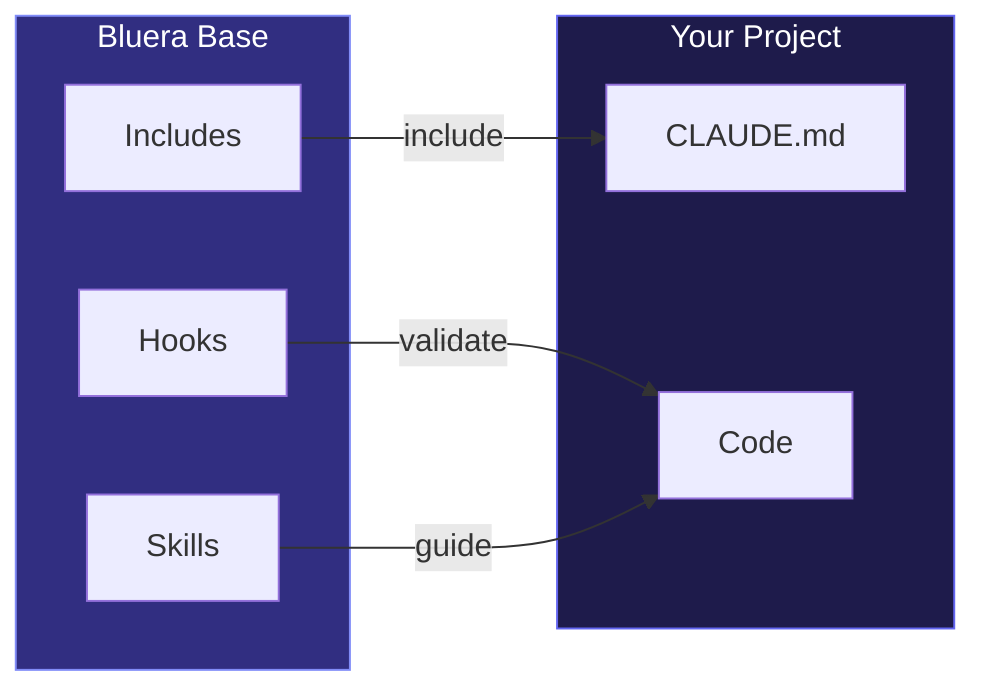

# Bluera Base

[](https://github.com/blueraai/bluera-base/actions/workflows/ci.yml)
[](https://github.com/blueraai/bluera-base/releases)


> **Shared development conventions for any project.** Multi-language hooks, skills, and CLAUDE.md patterns for consistent Claude Code workflows.

---

## Why Bluera Base?

When developing projects with Claude Code, you want consistent conventions across all your repos:

| Without | With Bluera Base |
|---------|------------------|
| Copy-paste hooks across projects | Install once, inherit conventions |
| Inconsistent CLAUDE.md patterns | Standardized sections via @includes |
| Duplicate code-review skills | Shared, battle-tested skill |
| Manual lint/typecheck validation | Automatic PostToolUse hooks |
| JS/TS only tooling | Multi-language support (13 languages) |

**The result:** Every project gets the same quality gates and conventions, without duplication.



---

## Table of Contents

<details>
<summary>Click to expand</summary>

- [Why Bluera Base?](#why-bluera-base)
- [Installation](#installation)
- [What's Included](#whats-included)
  - [Hooks](#hooks)
  - [Commands](#commands)
  - [Skills](#skills)
- [Supported Languages](#supported-languages)
  - [Auto-Validation](#auto-validation)
  - [Harden Repo](#harden-repo)
  - [Package Manager Auto-Detection](#package-manager-auto-detection)
- [Learning System](#learning-system)
- [Documentation](#documentation)
- [License](#license)
- [Support](#support)

</details>

---

## Installation

### Claude Code Plugin

```bash
# Add the Bluera marketplace (one-time setup)
/plugin marketplace add blueraai/bluera-marketplace

# Install the plugin
/plugin install bluera-base@bluera
```

### Manual (Development)

```bash
claude --plugin-dir /path/to/bluera-base
```

---

## What's Included

### Hooks

| Hook | Event | Purpose |
|------|-------|---------|
| `session-setup.sh` | SessionStart | Check jq dependency, fix hook permissions, update .gitignore, export env vars |
| `session-start-inject.sh` | SessionStart | Inject context/invariants into session |
| `pre-compact.sh` | PreCompact | Validate invariants before compaction |
| `post-edit-check.sh` | PostToolUse (Write/Edit) | Auto-lint, typecheck, anti-pattern detection |
| `observe-learning.sh` | PreToolUse (Bash) | Track patterns for auto-learning |
| `block-manual-release.sh` | PreToolUse (Bash) | Enforces `/bluera-base:release`; blocks `--no-verify` |
| `standards-review.sh` | PreToolUse (Bash) | Review staged code against CLAUDE.md on commit |
| `milhouse-stop.sh` | Stop | Intercepts exit to continue milhouse loop iterations |
| `session-end-learn.sh` | Stop | Consolidate learnings at session end |
| `session-end-analyze.sh` | Stop | Deep learning via Claude CLI (semantic session analysis) |
| `dry-scan.sh` | Stop | Scan for code duplication at session end |
| `auto-commit.sh` | Stop | Prompts to run `/bluera-base:commit` on session stop |
| `notify.sh` | Notification | Cross-platform notifications (macOS/Linux/Windows) |

→ [Full hooks documentation](docs/hooks.md)

### Commands

All commands are prefixed with `/bluera-base:` (e.g., `/bluera-base:commit`).

#### Development

| Command | Description |
|---------|-------------|
| `/commit` | Create atomic commits grouped by logical features, with README/CLAUDE.md awareness |
| `/code-review` | Multi-agent codebase review with confidence scoring |
| `/release` | Cut releases with conventional commits auto-detection and CI monitoring |
| `/milhouse` | Iterative development loop — repeats a prompt until task completion |
| `/todo` | Structured project tasks with requirements, outcomes, and learnings |
| `/checklist` | Lightweight checkbox list with automatic session-start reminders |
| `/learn` | Review, apply, or dismiss semantic learnings from session analysis |
| `/memory` | Cross-project knowledge store — persists insights across repos |

#### Setup & Configuration

| Command | Description |
|---------|-------------|
| `/init` | Initialize project with bluera-base conventions (config, rules, CLAUDE.md) |
| `/settings` | Manage feature toggles — enable/disable auto-learn, notifications, etc. |
| `/install-rules` | Install rule templates to `.claude/rules/` |
| `/harden-repo` | Set up linters, formatters, git hooks, and coverage for 13 languages |
| `/create` | Interactively scaffold new plugin components (skills, hooks, agents) |

#### Analysis & Quality

| Command | Description |
|---------|-------------|
| `/dry` | Detect duplicate code using jscpd, suggest DRY refactors |
| `/claude-code-audit-plugin` | Audit a Claude Code plugin against best practices |
| `/claude-code-analyze-config` | Scan `.claude/**` for overlap with bluera-base |
| `/claude-code-disk` | View disk usage and clean up `~/.claude/` storage |
| `/large-file-refactor` | Break apart files that exceed Claude's token limits |
| `/tech-debt-and-refactor-scan` | Scan codebase for tech debt and structural issues |

#### Documentation

| Command | Description |
|---------|-------------|
| `/claude-code-md` | Audit, initialize, or update CLAUDE.md memory files |
| `/readme` | Maintain README.md with GitHub tables, badges, diagrams, collapsible sections |

#### Tools

| Command | Description |
|---------|-------------|
| `/worktree` | Manage Git worktrees for isolated parallel development |
| `/claude-code-statusline` | Configure terminal status line with presets and custom modules |
| `/claude-code-test-plugin` | Run comprehensive plugin validation test suite |
| `/claude-code-graph` | Generate dependency graph of plugin components |

#### Guidance

| Command | Description |
|---------|-------------|
| `/claude-code-guide` | Expert guidance for Claude Code plugins, hooks, skills, and MCP |
| `/browser-inference-guide` | Expert guidance for in-browser ML/LLM inference (WebGPU, WASM, WebNN) |
| `/explain` | Explain bluera-base features in plain language |
| `/help` | Quick reference for all commands, hooks, and config |

<details>
<summary><strong>Command Arguments Reference</strong></summary>

**`/init`**

- `--quick` — Config, rules, and CLAUDE.md only (default)
- `--full` — Full setup: linting, formatting, hooks, and interactive feature enablement

**`/settings`**

- `show` — Display current effective configuration
- `init` — Create config file with defaults
- `set <key> <value>` — Set a config value
- `enable <feature>` — Turn on a feature (e.g., `auto-learn`, `notifications`, `auto-commit`)
- `disable <feature>` — Turn off a feature
- `reset` — Reset to defaults
- `status` — Show enabled/disabled feature summary

**`/milhouse`**

- `--inline "<prompt>"` — Provide the iteration prompt inline
- `--max-iterations N` — Cap the number of iterations (0 = unlimited)
- `--promise "<text>"` — Assertion that must remain true each iteration
- `--gate "<command>"` — Shell command that must exit 0 to continue
- `--stuck-limit N` — Stop after N iterations with no progress
- `cancel` — Stop an active milhouse loop

**`/harden-repo`**

- `--language <lang>` — Target a specific language (auto-detected if omitted)
- `--skip-hooks` — Skip git hook setup
- `--coverage <N>` — Set coverage threshold (default: 80%)

**`/dry`**

- `scan` — Run duplicate detection (default)
- `report` — Show last scan results
- `config` — Show/edit detection settings
- `--threshold N` — Minimum token count to flag (default: 70)
- `--path <dir>` — Scan a specific directory

**`/claude-code-disk`**

- *(no args)* — Show disk usage summary
- `--clean` — Interactive cleanup of old sessions, backups, and caches
- `--json` — Output as JSON
- `--backups` — List statusline backups
- `--restore <timestamp>` — Restore a statusline backup

**`/worktree`**

- `list` — Show all worktrees
- `add <branch> [base]` — Create a new worktree
- `remove <branch>` — Remove a worktree
- `prune` — Clean up stale worktree references
- `status` — Show status of all worktrees

**`/learn`**

- `show` — Display pending learnings
- `apply` — Write approved learnings to CLAUDE.local.md
- `dismiss` — Discard pending learnings
- `clear` — Remove all stored learnings

**`/memory`**

- `add` — Store a new cross-project memory
- `get` — Retrieve a memory by ID
- `search <query>` — Find memories by content
- `tag <id> <tags>` — Add tags to a memory
- `edit <id>` — Modify a memory
- `delete <id>` — Remove a memory

**`/claude-code-md`**

- `audit` — Check CLAUDE.md for staleness and structure issues
- `init` — Create a new CLAUDE.md with progressive disclosure template
- `learn` — Extract learnings from the current session into CLAUDE.md

**`/readme`**

- `beautify [instructions]` — Improve formatting with tables, badges, diagrams
- `breakout` — Split large READMEs into modular docs/ files
- `audit` — Verify documentation accuracy against codebase

**`/claude-code-guide`**

- `<question>` — Ask about Claude Code features, hooks, skills, MCP
- `review` — Review current plugin against best practices
- `audit [path] [focus]` — Comprehensive audit against checklist

**`/browser-inference-guide`**

- `<question>` — Ask about WebGPU, WASM, WebNN, or browser inference topics
- `review` — Review an implementation against the engineering spec
- `audit [path] [focus]` — Audit against browser inference checklist

**`/claude-code-statusline`**

- `show` — Display current statusline configuration
- `preset <name>` — Apply a preset (minimal, informative, developer, system, bluera)
- `custom` — Build a custom statusline interactively
- `reset` — Remove statusline configuration

**`/help`**

- `commands` — List all commands
- `skills` — List all skills
- `hooks` — Explain automatic hooks
- `config` — Show configuration options
- `all` — Show everything (default)

**`/explain`**

- `overview` — High-level plugin summary
- `features` — Feature breakdown
- `commands` — Command walkthrough
- `behaviors` — Hook and automation details
- `config` — Configuration deep-dive
- `philosophy` — Design principles

</details>

### Skills

29 skills power the commands above. Each skill is a markdown-defined workflow that Claude follows.

| Skill | Purpose |
|-------|---------|
| `browser-inference-guide` | Expert guidance for in-browser ML/LLM inference |
| `checklist` | Lightweight project checklist with session-start reminders |
| `claude-code-analyze-config` | Analyze `.claude/**` for overlap with bluera-base |
| `claude-code-audit-plugin` | Audit Claude Code plugins against best practices |
| `claude-code-disk` | View disk usage and clean up `~/.claude/` storage |
| `claude-code-graph` | Generate dependency graph of plugin components |
| `claude-code-guide` | Expert guidance for Claude Code plugins, hooks, skills, and MCP |
| `claude-code-md` | CLAUDE.md validation with progressive disclosure templates |
| `claude-code-statusline` | Terminal status line configuration with presets |
| `claude-code-test-plugin` | Run comprehensive plugin validation test suite |
| `code-review` | Multi-agent codebase review with confidence scoring |
| `commit` | Atomic commits grouped by logical features with doc awareness |
| `settings` | Manage bluera-base plugin configuration |
| `create` | Interactively scaffold plugin components (skills, hooks, agents) |
| `dry` | Detect duplicate code using jscpd |
| `explain` | Explain all bluera-base plugin functionality |
| `harden-repo` | Language-specific linting, formatting, hooks, and coverage |
| `help` | Show plugin features and usage |
| `init` | Initialize project with bluera-base conventions |
| `install-rules` | Install rule templates into `.claude/rules/` |
| `large-file-refactor` | Analyze and split large files when token limits exceeded |
| `learn` | Manage semantic learnings (show, apply, dismiss) |
| `memory` | Cross-project global memory management |
| `milhouse` | Iterative development loop |
| `readme` | README.md formatting with tables, badges, diagrams |
| `release` | Release workflow with multi-language version bumping |
| `tech-debt-and-refactor-scan` | Scan codebase for tech debt and structural issues |
| `todo` | Structured project tasks with outcomes and learnings |
| `worktree` | Git worktree management for parallel development |

→ [Full skills documentation](docs/skills.md)

### CLAUDE.md Includes

| Include | Content |
|---------|---------|
| `CLAUDE-BASE.md` | Header/purpose, hierarchical explanation, ALWAYS/NEVER rules |

---

## Supported Languages

### Auto-Validation

*Via `post-edit-check.sh` hook*

The hook automatically detects and validates:

| Language | Detection | Linter | Type Checker |
|----------|-----------|--------|--------------|
| **JavaScript/TypeScript** | `package.json` | ESLint | tsc |
| **Python** | `pyproject.toml` | ruff | mypy |
| **Rust** | `Cargo.toml` | cargo clippy | cargo check |
| **Go** | `go.mod` | Anti-pattern only | — |
| **Makefile** | `Makefile` | make lint | make typecheck |

> **Note:** Lint and typecheck failures are advisory (non-blocking). Checks run at most once per 30 seconds to avoid slowing down frequent edits.

### Harden Repo

*Via `/bluera-base:harden-repo` command*

Full tooling setup (linting, formatting, hooks, coverage) for 13 languages:

| Language | Linter | Formatter | Coverage |
|----------|--------|-----------|----------|
| **JavaScript/TypeScript** | ESLint | Prettier | c8 |
| **Python** | ruff | ruff | pytest-cov |
| **Rust** | clippy | rustfmt | cargo-tarpaulin |
| **Go** | golangci-lint | gofmt | go test -cover |
| **Java** | Checkstyle | google-java-format | JaCoCo |
| **Kotlin** | detekt | ktlint | Kover |
| **Ruby** | RuboCop | RuboCop | SimpleCov |
| **PHP** | PHPStan | PHP-CS-Fixer | PCOV |
| **C#/.NET** | Roslyn | dotnet format | coverlet |
| **Swift** | SwiftLint | SwiftFormat | llvm-cov |
| **Elixir** | Credo | mix format | excoveralls |
| **C/C++** | clang-tidy | clang-format | gcov/lcov |
| **Scala** | scalafix | scalafmt | scoverage |

Default coverage threshold: **80%** (user-configurable)

### Package Manager Auto-Detection

*For JavaScript/TypeScript projects*

| Lockfile | Runner Used |
|----------|-------------|
| `bun.lockb` or `bun.lock` | `bun` |
| `yarn.lock` | `yarn` |
| `pnpm-lock.yaml` | `pnpm` |
| (none or `package-lock.json`) | `npm` |

---

## Configuration

| Path | Purpose |
|------|---------|
| `.claude/settings.json` | Claude Code permissions and settings |
| `.bluera/bluera-base/config.json` | Plugin feature toggles (auto-learn, notifications, etc.) |

See [Configuration](docs/configuration.md) for feature toggles and [Usage](docs/usage.md) for Claude Code settings.

---

## Learning System

Bluera Base can learn from your sessions and incorporate insights back into Claude's context.


| Feature | What It Does | Enable |
|---------|--------------|--------|
| **Auto-Learn** | Tracks recurring commands, suggests CLAUDE.md edits | `/settings enable auto-learn` |
| **Deep-Learn** | AI analysis of sessions via Claude CLI (~$0.001/session) | `/settings enable deep-learn` |

Learnings are stored in a marked section of `CLAUDE.local.md`:

```markdown
<!-- AUTO:bluera-base:learned -->
- Check git status before commits
- Run tests before pushing
<!-- END:bluera-base:learned -->
```

See [Learning System](docs/learning.md) for the full flow and configuration.

---

## Documentation

| Guide | Description |
|-------|-------------|
| [Commands](docs/commands.md) | Full command reference |
| [Configuration](docs/configuration.md) | Feature toggles, config schema |
| [Hooks](docs/hooks.md) | Hook details, flow diagrams, configuration |
| [Skills](docs/skills.md) | Skill workflows, usage examples |
| [Learning System](docs/learning.md) | Auto-learn and deep-learn flow |
| [Usage](docs/usage.md) | @includes, overriding skills, settings templates |
| [Customization](docs/customization.md) | Trigger files, hooks, rules |
| [Development](docs/development.md) | Setup, dogfooding, project structure |
| [Troubleshooting](docs/troubleshooting.md) | Common issues and solutions |
| [Hook Examples](docs/hook-examples.md) | Additional hook patterns |
| [Advanced Patterns](docs/advanced-patterns.md) | State bus, loops, token efficiency |
| [Command Patterns](docs/command-patterns.md) | Command conventions and examples |
| [Best Practices](docs/claude-code-best-practices.md) | Comprehensive Claude Code guide |
| [Contributing](CONTRIBUTING.md) | How to contribute |

---

## License

MIT - See [LICENSE](./LICENSE) for details.

---

## Support

- **Issues**: [GitHub Issues](https://github.com/blueraai/bluera-base/issues)
- **Documentation**: [Claude Code Plugins](https://code.claude.com/docs/en/plugins)
