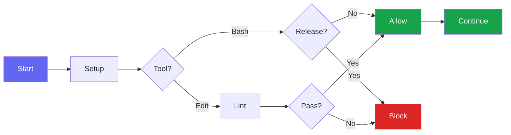

# Bluera Base

[](https://github.com/blueraai/bluera-base/actions/workflows/ci.yml)


> **Shared development conventions for any project.** Multi-language hooks, skills, and CLAUDE.md patterns for consistent Claude Code workflows.

---

## Why Bluera Base?

When developing projects with Claude Code, you want consistent conventions across all your repos:

| Without | With Bluera Base |
|---------|------------------|
| Copy-paste hooks across projects | Install once, inherit conventions |
| Inconsistent CLAUDE.md patterns | Standardized sections via @includes |
| Duplicate code-review skills | Shared, battle-tested skill |
| Manual lint/typecheck validation | Automatic PostToolUse hooks |
| JS/TS only tooling | Multi-language support (JS/TS, Python, Rust, Go) |

**The result:** Every project gets the same quality gates and conventions, without duplication.

```mermaid
flowchart LR
    subgraph Project[Your Project]
        A[CLAUDE.md]
        B[Code]
    end

    subgraph BB[Bluera Base]
        C[Hooks]
        D[Skills]
        E[Includes]
    end

    E -->|@include| A
    C -->|validate| B
    D -->|guide| B

    style Project fill:#1e1b4b,stroke:#6366f1,color:#fff
    style BB fill:#312e81,stroke:#818cf8,color:#fff
```

---

## Table of Contents

<details>
<summary>Click to expand</summary>

- [Why Bluera Base?](#why-bluera-base)
- [Installation](#installation)
- [What's Included](#whats-included)
- [Supported Languages](#supported-languages)
- [Documentation](#documentation)
- [License](#license)

</details>

---

## Installation

### Claude Code Plugin

```bash
# Add the Bluera marketplace (one-time setup)
/plugin marketplace add blueraai/bluera-marketplace

# Install the plugin
/plugin install bluera-base@bluera
```

### Manual (Development)

```bash
claude --plugin-dir /path/to/bluera-base
```

---

## What's Included

### Hooks

| Hook | Event | Purpose |
|------|-------|---------|
| `session-setup.sh` | SessionStart | Check jq dependency, fix hook permissions |
| `post-edit-check.sh` | PostToolUse (Write/Edit) | Auto-lint, typecheck, anti-pattern detection |
| `block-manual-release.sh` | PreToolUse (Bash) | Enforces `/release` command for releases |
| `milhouse-stop.sh` | Stop | Intercepts exit to continue milhouse loop iterations |
| `notify.sh` | Notification | Cross-platform notifications (macOS/Linux/Windows) |



<details>
<summary><b>What post-edit-check.sh does</b></summary>

On every Write/Edit operation, the hook auto-detects your project type and runs appropriate checks:

**JavaScript/TypeScript:**
- Auto-detects package manager (bun/yarn/pnpm/npm) from lockfiles
- Runs ESLint with `--fix` on modified files
- Type-checks with `tsc --noEmit` if tsconfig.json exists

**Python:**
- Runs `ruff check --fix` (preferred) or `flake8`
- Type-checks with `mypy` if pyproject.toml/mypy.ini exists

**Rust:**
- Auto-formats with `cargo fmt`
- Runs `cargo clippy` for linting
- Runs `cargo check` for compile errors

**Go:**
- Runs `golangci-lint` (preferred) or `go vet`

**All Languages:**
- Anti-pattern detection: blocks `fallback`, `deprecated`, `backward compatibility`, `legacy`

Exit code 2 blocks the operation and shows the error to Claude.

</details>

### Commands

| Command | Purpose |
|---------|---------|
| `/commit` | Create atomic, well-organized commits with documentation checks |
| `/code-review` | Run multi-agent codebase review |
| `/release` | Cut a release with conventional commits auto-detection and CI monitoring |
| `/milhouse-loop` | Start iterative development loop with configurable completion criteria |
| `/cancel-milhouse` | Cancel active milhouse loop |
| `/install-rules` | Install bluera-base rule templates to `.claude/rules/` |
| `/claude-md` | Audit and maintain CLAUDE.md files |
| `/readme` | Maintain README.md files with GitHub advanced formatting |
| `/test-plugin` | Run plugin validation test suite |

### Skills

| Skill | Purpose |
|-------|---------|
| `code-review-repo` | Multi-agent codebase review with confidence scoring |
| `atomic-commits` | Guidelines for logical commit grouping with README/CLAUDE.md awareness |
| `release` | Release workflow with multi-language version bumping |
| `milhouse` | Iterative development loop documentation |
| `claude-md-maintainer` | CLAUDE.md validation with progressive disclosure templates |
| `readme-maintainer` | README.md formatting with tables, badges, diagrams, collapsible sections |

<details>
<summary><b>code-review-repo details</b></summary>

Launches 5 parallel agents to independently review your codebase:

1. **CLAUDE.md compliance** - Check code follows all CLAUDE.md guidelines
2. **Bug scan** - Look for obvious bugs, error handling issues
3. **Git history context** - Use blame/history to identify patterns
4. **PR comments** - Check closed PRs for applicable feedback
5. **Code comment compliance** - Ensure TODO/FIXME notes are addressed

Each issue gets a confidence score (0-100). Only issues scoring >= 80 are reported.

</details>

<details>
<summary><b>release skill details</b></summary>

The `/release` command provides a standardized release workflow:

```mermaid
flowchart LR
    A[/release] --> B{Clean?}
    B -->|No| C[Abort]
    B -->|Yes| D[Analyze]
    D --> E{Type?}
    E -->|fix| F[patch]
    E -->|feat| G[minor]
    E -->|BREAKING| H[major]
    F --> I[Bump]
    G --> I
    H --> I
    I --> J[Push]

    style A fill:#6366f1,color:#fff
    style C fill:#dc2626,color:#fff
    style J fill:#16a34a,color:#fff
```

| Commit Type | Version Bump | Example |
|-------------|--------------|---------|
| `fix:` | patch (0.0.x) | Bug fixes |
| `feat:` | minor (0.x.0) | New features |
| `feat!:` / `BREAKING CHANGE:` | major (x.0.0) | Breaking changes |

**Language-specific tools:**
- **JS/TS:** `npm version`
- **Python:** `poetry version`, `hatch version`, or `bump2version`
- **Rust:** `cargo release`
- **Go:** git tags

The `block-manual-release.sh` hook prevents bypassing this workflow by blocking direct version/release commands.

</details>

<details>
<summary><b>milhouse loop details</b></summary>

The milhouse loop is an iterative development pattern:

```mermaid
flowchart LR
    A[/milhouse] --> B[Load]
    B --> C[Work]
    C --> D{Done?}
    D -->|No| E[Intercept]
    E --> C
    D -->|Yes| F[Exit]

    style A fill:#6366f1,color:#fff
    style F fill:#16a34a,color:#fff
```

**Usage:**
```bash
/milhouse-loop .claude/prompts/task.md --max-iterations 10 --promise "FEATURE DONE"
```

**Exit conditions:**
| Condition | What Happens |
|-----------|--------------|
| `<promise>TEXT</promise>` in output | Loop exits successfully |
| Max iterations reached | Loop exits with warning |
| `/cancel-milhouse` | Loop cancelled |

</details>

### CLAUDE.md Includes

| Include | Content |
|---------|---------|
| `CLAUDE-BASE.md` | Header/purpose, hierarchical explanation, ALWAYS/NEVER rules |

---

## Supported Languages

The `post-edit-check.sh` hook automatically detects and validates:

| Language | Detection | Linter | Type Checker |
|----------|-----------|--------|--------------|
| **JavaScript/TypeScript** | `package.json` | ESLint | tsc |
| **Python** | `pyproject.toml`, `requirements.txt`, `setup.py` | ruff / flake8 | mypy |
| **Rust** | `Cargo.toml` | cargo clippy | cargo check |
| **Go** | `go.mod` | golangci-lint / go vet | - |

### Package Manager Auto-Detection (JS/TS)

| Lockfile | Runner Used |
|----------|-------------|
| `bun.lockb` | `bun` |
| `yarn.lock` | `yarn` |
| `pnpm-lock.yaml` | `pnpm` |
| (none or `package-lock.json`) | `npx` |

---

## Documentation

| Guide | Description |
|-------|-------------|
| [Usage](docs/usage.md) | @includes, overriding skills, settings templates |
| [Customization](docs/customization.md) | Trigger files, hooks, rules, architectural constraints |
| [Development](docs/development.md) | Setup, dogfooding, project structure |
| [Contributing](CONTRIBUTING.md) | How to contribute |

---

## License

MIT - See [LICENSE](./LICENSE) for details.

---

## Support

- **Issues**: [GitHub Issues](https://github.com/blueraai/bluera-base/issues)
- **Documentation**: [Claude Code Plugins](https://code.claude.com/docs/en/plugins)
