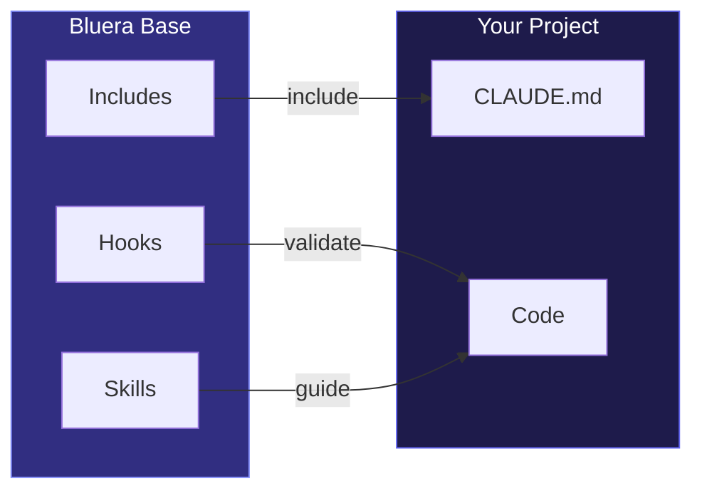

# Bluera Base

[](https://github.com/blueraai/bluera-base/actions/workflows/ci.yml)
[](https://github.com/blueraai/bluera-base/releases)


> **Shared development conventions for any project.** Multi-language hooks, skills, and CLAUDE.md patterns for consistent Claude Code workflows.

---

## Why Bluera Base?

When developing projects with Claude Code, you want consistent conventions across all your repos:

| Without | With Bluera Base |
|---------|------------------|
| Copy-paste hooks across projects | Install once, inherit conventions |
| Inconsistent CLAUDE.md patterns | Standardized sections via @includes |
| Duplicate code-review skills | Shared, battle-tested skill |
| Manual lint/typecheck validation | Automatic PostToolUse hooks |
| JS/TS only tooling | Multi-language support (13 languages) |

**The result:** Every project gets the same quality gates and conventions, without duplication.



---

## Table of Contents

<details>
<summary>Click to expand</summary>

- [Why Bluera Base?](#why-bluera-base)
- [Installation](#installation)
- [What's Included](#whats-included)
  - [Hooks](#hooks)
  - [Commands](#commands)
  - [Skills](#skills)
- [Supported Languages](#supported-languages)
  - [Auto-Validation](#auto-validation)
  - [Repo Hardening](#repo-hardening)
  - [Package Manager Auto-Detection](#package-manager-auto-detection)
- [Documentation](#documentation)
- [License](#license)
- [Support](#support)

</details>

---

## Installation

### Claude Code Plugin

```bash
# Add the Bluera marketplace (one-time setup)
/plugin marketplace add blueraai/bluera-marketplace

# Install the plugin
/plugin install bluera-base@bluera
```

### Manual (Development)

```bash
claude --plugin-dir /path/to/bluera-base
```

---

## What's Included

### Hooks

| Hook | Event | Purpose |
|------|-------|---------|
| `session-setup.sh` | SessionStart | Check jq dependency, fix hook permissions, update .gitignore, export env vars |
| `session-start-inject.sh` | SessionStart | Inject context/invariants into session |
| `pre-compact.sh` | PreCompact | Validate invariants before compaction |
| `post-edit-check.sh` | PostToolUse (Write/Edit) | Auto-lint, typecheck, anti-pattern detection |
| `observe-learning.sh` | PreToolUse (Bash) | Track patterns for auto-learning |
| `block-manual-release.sh` | PreToolUse (Bash) | Enforces `/bluera-base:release`; blocks `--no-verify` |
| `standards-review.sh` | PreToolUse (Bash) | Review staged code against CLAUDE.md on commit (opt-in) |
| `milhouse-stop.sh` | Stop | Intercepts exit to continue milhouse loop iterations |
| `session-end-learn.sh` | Stop | Consolidate learnings at session end |
| `session-end-analyze.sh` | Stop | Deep learning via Claude CLI (semantic session analysis) |
| `dry-scan.sh` | Stop | Scan for code duplication at session end |
| `auto-commit.sh` | Stop | Prompts to run `/bluera-base:commit` on session stop (opt-in) |
| `notify.sh` | Notification | Cross-platform notifications (macOS/Linux/Windows) |

→ [Full hooks documentation](docs/hooks.md)

### Commands

| Command | Arguments | Purpose |
|---------|-----------|---------|
| `/init` | `[--quick\|--full]` | Initialize project with bluera-base conventions |
| `/commit` | | Create atomic commits with README/CLAUDE.md awareness |
| `/code-review` | | Multi-agent codebase review |
| `/release` | | Cut release with conventional commits and CI monitoring |
| `/config` | `[show\|init\|set\|enable\|disable\|reset\|status] [key] [value]` | Manage plugin configuration |
| `/milhouse-loop` | `<prompt-file> [--inline TEXT] [--max-iterations N] [--promise TEXT] [--gate CMD] [--stuck-limit N] [--init-harness]` | Start iterative development loop |
| `/cancel-milhouse` | | Cancel active milhouse loop |
| `/clean` | `[scan\|fix <action>\|backups <list\|restore>] [--confirm] [--days N]` | Diagnose slow startup and guide cleanup |
| `/install-rules` | | Install rule templates to `.claude/rules/` |
| `/claude-md` | `<audit\|init\|learn> [options]` | Audit and maintain CLAUDE.md files |
| `/readme` | `<beautify\|breakout> [instructions]` | Maintain README.md with GitHub formatting |
| `/test-plugin` | | Run plugin validation test suite |
| `/dry` | `[scan\|report\|config\|init] [--threshold N] [--path <dir>]` | Detect duplicate code, suggest DRY refactors |
| `/harden-repo` | `[--language <lang>] [--skip-hooks] [--coverage <threshold>]` | Set up linters, formatters, git hooks (13 langs) |
| `/statusline` | `[show\|preset\|custom\|reset]` | Configure terminal status line |
| `/analyze-config` | `[--cleanup]` | Scan `.claude/**` for bluera-base overlap |
| `/audit-plugin` | `[path/to/plugin] [--fix]` | Audit plugin against best practices |
| `/help` | `[commands\|skills\|hooks\|config\|all]` | Show plugin features and usage |
| `/explain` | `[overview\|features\|commands\|behaviors\|config\|philosophy]` | Explain plugin functionality |
| `/todo` | | Manage project TODO tasks |
| `/worktree` | `[list\|add\|remove\|prune\|status] [args]` | Manage Git worktrees for parallel development |
| `/learn` | `[show\|apply\|dismiss\|clear]` | Manage semantic learnings from session analysis |
| `/large-file-refactor` | `<file>` | Break apart files that exceed token limits |

*All commands prefixed with `/bluera-base:` (e.g., `/bluera-base:commit`)*

### Skills

| Skill | Purpose |
|-------|---------|
| `code-review-repo` | Multi-agent codebase review with confidence scoring |
| `atomic-commits` | Guidelines for logical commit grouping with README/CLAUDE.md awareness |
| `release` | Release workflow with multi-language version bumping |
| `milhouse` | Iterative development loop documentation |
| `claude-md-maintainer` | CLAUDE.md validation with progressive disclosure templates |
| `readme-maintainer` | README.md formatting with tables, badges, diagrams, collapsible sections |
| `dry-refactor` | Language-specific guidance for DRY refactoring |
| `large-file-refactor` | Analyze and split large files when token limits exceeded |
| `repo-hardening` | Language-specific tooling for linting, formatting, hooks, and coverage |
| `statusline` | Status line configuration with presets |
| `auto-learn` | Auto-learning pattern detection and consolidation |
| `learn` | Deep learning management (show, apply, dismiss learnings) |
| `claude-cleaner` | Diagnose slow startup and guide cleanup |
| `worktree` | Git worktree management for parallel development |

→ [Full skills documentation](docs/skills.md)

### CLAUDE.md Includes

| Include | Content |
|---------|---------|
| `CLAUDE-BASE.md` | Header/purpose, hierarchical explanation, ALWAYS/NEVER rules |

---

## Supported Languages

### Auto-Validation

*Via `post-edit-check.sh` hook*

The hook automatically detects and validates:

| Language | Detection | Linter | Type Checker |
|----------|-----------|--------|--------------|
| **JavaScript/TypeScript** | `package.json` | ESLint | tsc |
| **Python** | `pyproject.toml` | ruff | mypy |
| **Rust** | `Cargo.toml` | cargo clippy | cargo check |
| **Go** | `go.mod` | Anti-pattern only | — |
| **Makefile** | `Makefile` | make lint | make typecheck |

> **Note:** Lint and typecheck failures are advisory (non-blocking). Checks run at most once per 30 seconds to avoid slowing down frequent edits.

### Repo Hardening

*Via `/bluera-base:harden-repo` command*

Full tooling setup (linting, formatting, hooks, coverage) for 13 languages:

| Language | Linter | Formatter | Coverage |
|----------|--------|-----------|----------|
| **JavaScript/TypeScript** | ESLint | Prettier | c8 |
| **Python** | ruff | ruff | pytest-cov |
| **Rust** | clippy | rustfmt | cargo-tarpaulin |
| **Go** | golangci-lint | gofmt | go test -cover |
| **Java** | Checkstyle | google-java-format | JaCoCo |
| **Kotlin** | detekt | ktlint | Kover |
| **Ruby** | RuboCop | RuboCop | SimpleCov |
| **PHP** | PHPStan | PHP-CS-Fixer | PCOV |
| **C#/.NET** | Roslyn | dotnet format | coverlet |
| **Swift** | SwiftLint | SwiftFormat | llvm-cov |
| **Elixir** | Credo | mix format | excoveralls |
| **C/C++** | clang-tidy | clang-format | gcov/lcov |
| **Scala** | scalafix | scalafmt | scoverage |

Default coverage threshold: **80%** (user-configurable)

### Package Manager Auto-Detection

*For JavaScript/TypeScript projects*

| Lockfile | Runner Used |
|----------|-------------|
| `bun.lockb` or `bun.lock` | `bun` |
| `yarn.lock` | `yarn` |
| `pnpm-lock.yaml` | `pnpm` |
| (none or `package-lock.json`) | `npm` |

---

## Configuration

| Path | Purpose |
|------|---------|
| `.claude/settings.json` | Claude Code permissions and settings |
| `.bluera/bluera-base/config.json` | Plugin feature toggles (auto-learn, notifications, etc.) |

See [Configuration](docs/configuration.md) for feature toggles and [Usage](docs/usage.md) for Claude Code settings.

---

## Documentation

| Guide | Description |
|-------|-------------|
| [Commands](docs/commands.md) | Full command reference |
| [Configuration](docs/configuration.md) | Feature toggles, config schema |
| [Hooks](docs/hooks.md) | Hook details, flow diagrams, configuration |
| [Skills](docs/skills.md) | Skill workflows, usage examples |
| [Usage](docs/usage.md) | @includes, overriding skills, settings templates |
| [Customization](docs/customization.md) | Trigger files, hooks, rules |
| [Development](docs/development.md) | Setup, dogfooding, project structure |
| [Troubleshooting](docs/troubleshooting.md) | Common issues and solutions |
| [Hook Examples](docs/hook-examples.md) | Additional hook patterns |
| [Contributing](CONTRIBUTING.md) | How to contribute |

---

## License

MIT - See [LICENSE](./LICENSE) for details.

---

## Support

- **Issues**: [GitHub Issues](https://github.com/blueraai/bluera-base/issues)
- **Documentation**: [Claude Code Plugins](https://code.claude.com/docs/en/plugins)
