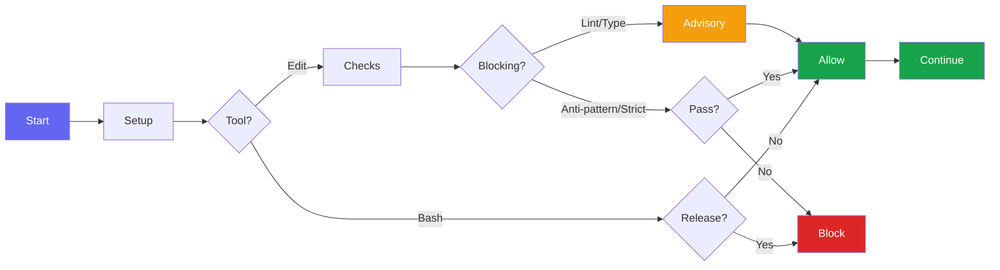

# Hooks

Bluera Base provides automatic validation hooks that run during Claude Code sessions.

## Hook Summary

| Hook | Event | Purpose |
|------|-------|---------|
| `session-setup.sh` | SessionStart | Check jq dependency, fix hook permissions, update .gitignore, export BLUERA_* env vars |
| `session-start-inject.sh` | SessionStart | Inject context/invariants into session |
| `pre-compact.sh` | PreCompact | Validate invariants before compaction |
| `post-edit-check.sh` | PostToolUse (Write/Edit) | Auto-lint, typecheck, anti-pattern detection |
| `observe-learning.sh` | PreToolUse (Bash) | Track patterns for auto-learning |
| `block-manual-release.sh` | PreToolUse (Bash) | Enforces `/bluera-base:release` command for releases |
| `milhouse-stop.sh` | Stop | Intercepts exit to continue milhouse loop iterations |
| `session-end-learn.sh` | Stop | Consolidate learnings at session end |
| `dry-scan.sh` | Stop | Scan for code duplication at session end |
| `auto-commit.sh` | Stop | Blocks session stop and prompts to run `/bluera-base:commit` if uncommitted changes exist (opt-in) |
| `notify.sh` | Notification | Cross-platform notifications (macOS/Linux/Windows) |

## Hook Flow



> **Note:** Lint and typecheck failures are advisory (non-blocking). Anti-pattern detection and strict typing checks (when enabled) block the operation.

---

## post-edit-check.sh

On every Write/Edit operation, the hook auto-detects your project type and runs appropriate checks.

### JavaScript/TypeScript

- Auto-detects package manager (bun/yarn/pnpm/npm) from lockfiles
- Runs project lint script: `$runner run lint --quiet`
- Runs project typecheck: `typecheck`, `type-check`, or `tsc` scripts
- Falls back to `tsc --noEmit` if tsconfig.json exists with no script

### Python

- Runs `poetry run lint` or `ruff check` (read-only, no auto-fix)
- Type-checks with `mypy` if configured

### Rust

- Runs `cargo clippy` for linting (errors only)
- Runs `cargo check` for compile errors

### Supported Languages

TypeScript, JavaScript, Python, Rust (full lint/typecheck support), Go (anti-pattern detection only)

### All Source Files

- **Anti-pattern detection**: Blocks `fallback`, `deprecated`, `backward compatibility`, `legacy` patterns
- **Lint suppression detection**: Blocks new rule suppressions in `.eslintrc*`, `.markdownlint*`, `pyproject.toml`, etc.
- **Strict typing** (opt-in via `/bluera-base:config enable strict-typing`):
  - TypeScript: blocks `any`, unsafe `as` casts, `@ts-nocheck`; allows `@ts-ignore` with 10+ char explanation
  - Python: blocks `Any`, `cast()`; allows `type: ignore` with error code (e.g., `[code]`)
  - Escape hatch: `// ok:` (TS) or `# ok:` (Python) suppresses on specific lines

Exit code 2 blocks the operation and shows the error to Claude.

---

## block-manual-release.sh

Prevents bypassing the release workflow by blocking direct version/release commands like:

- `npm version`
- `poetry version`
- `cargo release`

Use `/bluera-base:release` instead for standardized releases.

---

## milhouse-stop.sh

Intercepts the Stop event to continue iterative development loops. When a milhouse loop is active, this hook feeds the prompt back to continue work until completion criteria are met.

---

## auto-commit.sh

**Opt-in feature.** Enable with:

```bash
/bluera-base:config enable auto-commit
```

When enabled, blocks session stop and prompts you to run `/bluera-base:commit` if there are uncommitted changes.

---

## notify.sh

Sends cross-platform notifications for long-running operations:

- **macOS**: Uses `osascript` for native notifications
- **Linux**: Uses `notify-send`
- **Windows**: Uses PowerShell toast notifications

---

## session-start-inject.sh

Injects critical context and invariants into every session via `additionalContext` in the hook output.

---

## pre-compact.sh

Validates `.claude/critical-invariants.md` size before compaction and reminds that invariants will be re-injected after. Warns if the file is too large (>20 lines or >1500 chars) which would reduce compaction effectiveness.

### Critical Invariants Feature

The critical invariants feature helps maintain important rules across compaction:

1. Create `.claude/critical-invariants.md` with your must-follow rules (5-15 lines recommended)
2. The `session-start-inject.sh` hook injects these into every session
3. The `pre-compact.sh` hook validates size and confirms re-injection will occur
4. After compaction, invariants are automatically re-injected to prevent drift

Example invariants file:

```markdown
# Critical Invariants

- Run tests before commit
- Use conventional commit format
- Never use --no-verify on git commits
- Check README.md/CLAUDE.md when changing public APIs
```

---

## observe-learning.sh

Observes Bash commands during the session to identify patterns for auto-learning. Part of the auto-learn feature.

---

## session-end-learn.sh

Consolidates patterns observed during the session into learnings. Part of the auto-learn feature.

---

## dry-scan.sh

Scans for code duplication at session end using `jscpd`. Reports duplicates that could be refactored.

---

## See Also

- [Hook Examples](hook-examples.md) - Additional hook patterns
- [Customization](customization.md) - Creating custom hooks
