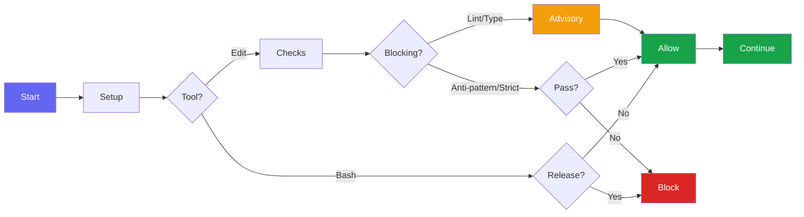

# Hooks

Bluera Base provides automatic validation hooks that run during Claude Code sessions.

## Hook Summary

| Hook | Event | Purpose |
|------|-------|---------|
| `session-setup.sh` | SessionStart | Check jq dependency, fix hook permissions, update .gitignore, export BLUERA_STATE_DIR/BLUERA_CONFIG/BLUERA_PROJECT_DIR env vars |
| `session-start-inject.sh` | SessionStart | Inject context/invariants into session |
| `pre-compact.sh` | PreCompact | Validate invariants before compaction |
| `post-edit-check.sh` | PostToolUse (Write/Edit) | Auto-lint, typecheck, anti-pattern detection |
| `observe-learning.sh` | PreToolUse (Bash) | Track patterns for auto-learning |
| `block-manual-release.sh` | PreToolUse (Bash) | Enforces `/bluera-base:release` command for releases |
| `milhouse-stop.sh` | Stop | Intercepts exit to continue milhouse loop iterations |
| `session-end-learn.sh` | Stop | Consolidate learnings at session end |
| `session-end-analyze.sh` | Stop | Deep learning via Claude CLI (semantic session analysis) |
| `dry-scan.sh` | Stop | Scan for code duplication at session end |
| `auto-commit.sh` | Stop | Blocks session stop and prompts to run `/bluera-base:commit` if uncommitted changes exist (opt-in) |
| `notify.sh` | Notification | Cross-platform notifications (macOS/Linux/Windows) |

## Hook Flow



> **Note:** Lint and typecheck failures are advisory (non-blocking). Anti-pattern detection and strict typing checks (when enabled) block the operation.

---

## post-edit-check.sh

On every Write/Edit operation, the hook auto-detects your project type and runs appropriate checks. Lint and typecheck run at most once per 30 seconds to avoid slowing down frequent edits.

### JavaScript/TypeScript

- Auto-detects package manager (bun/yarn/pnpm/npm) from lockfiles
- Runs project lint script: `$runner run lint`
- Runs project typecheck: `typecheck`, `type-check`, or `tsc` scripts
- Falls back to `tsc --noEmit` only if NO package.json exists but tsconfig.json and `node_modules/.bin/tsc` are present

### Python

- Runs `poetry run lint` or `ruff check` (read-only, no auto-fix)
- Type-checks with `mypy` if available and project uses type checking
- Note: Only mypy execution is supported; pyright configuration is detected but not executed

### Rust

- Runs `cargo clippy` for linting (errors only)
- Runs `cargo check` for compile errors

### Supported Languages

TypeScript, JavaScript, Python, Rust (full lint/typecheck support), Go (anti-pattern detection only)

### Makefile

- Runs `make lint` if Makefile has a `lint:` target
- Runs `make typecheck` if Makefile has a `typecheck:` target

### Source File Checks

Applies to: `.ts`, `.tsx`, `.js`, `.jsx`, `.mjs`, `.cjs`, `.py`, `.pyi`, `.rs`, `.go`

- **Anti-pattern detection**: Blocks `fallback`, `deprecated`, `backward compatibility`, `legacy` patterns
- **Lint suppression detection**: Blocks new rule suppressions in `.eslintrc*`, `.markdownlint*`, `pyproject.toml`, etc. (Note: Checks added lines in tracked files, or full file content for new/untracked files)
- **Strict typing** (opt-in via `/bluera-base:config enable strict-typing`):
  - TypeScript: blocks `any`, unsafe `as` casts, `@ts-nocheck`, `@ts-ignore` without 10+ char explanation
  - Python: blocks `Any`, `cast()`, `type: ignore` without error code `[code]`
  - Escape hatch: `// ok:` (TS) or `# ok:` (Python) suppresses strict typing AND lint suppression checks on that line

Exit code 2 blocks the operation and shows the error to Claude.

---

## block-manual-release.sh

Prevents bypassing the release workflow by blocking direct version/release commands:

- **npm/yarn/pnpm/bun:** `npm version`, `npm run release`, and equivalent yarn/pnpm/bun commands
- **Python:** `poetry version`, `bump2version`, `hatch version`
- **Rust:** `cargo release`
- **Git-based:** `git tag v[0-9]...`, `gh release create`

**Not blocked:** Makefile-based releases (`make release`, `make version`) are not detected.

Use `/bluera-base:release` instead for standardized releases.

Also blocks `git commit --no-verify` to enforce pre-commit hooks (CLAUDE-BASE.md rule).

---

## milhouse-stop.sh

Intercepts the Stop event to continue iterative development loops. When a milhouse loop is active, this hook feeds the prompt back to continue work until completion criteria are met.

---

## auto-commit.sh

**Opt-in feature.** Enable with:

```bash
/bluera-base:config enable auto-commit
```

When enabled, blocks session stop and prompts you to run `/bluera-base:commit` if there are uncommitted changes.

---

## notify.sh

Sends cross-platform desktop notifications when Claude Code needs your attention:

- **Permission prompts** - Tool approval requests
- **Idle prompts** - Waiting for user input
- **Elicitation dialogs** - Input requested

Platforms: macOS (`terminal-notifier` or `osascript`), Linux (`notify-send` or `kdialog`), Windows (PowerShell toast)

---

## session-start-inject.sh

Injects critical context and invariants into every session via `additionalContext` in the hook output.

---

## pre-compact.sh

Validates `.claude/critical-invariants.md` size before compaction and reminds that invariants will be re-injected after. Warns if the file is too large (>20 lines or >1500 chars); recommends keeping it under 1000 characters for optimal compaction effectiveness.

### Critical Invariants Feature

The critical invariants feature helps maintain important rules across compaction:

1. Create `.claude/critical-invariants.md` with your must-follow rules (5-15 lines recommended)
2. The `session-start-inject.sh` hook injects these into every session via `additionalContext`
3. The `pre-compact.sh` hook validates size and confirms re-injection will occur
4. After compaction, invariants are re-injected when the session resumes (via SessionStart `additionalContext`)

Example invariants file:

```markdown
# Critical Invariants

- Run tests before commit
- Use conventional commit format
- Never use --no-verify on git commits
- Check README.md/CLAUDE.md when changing public APIs
```

---

## observe-learning.sh

**Opt-in feature.** Enable with `/bluera-base:config enable auto-learn`.

Observes Bash commands during the session to identify patterns for auto-learning.

---

## session-end-learn.sh

**Opt-in feature.** Enable with `/bluera-base:config enable auto-learn`.

Consolidates patterns observed during the session into learnings.

---

## session-end-analyze.sh

**Opt-in feature.** Enable with `/bluera-base:config enable deep-learn`.

Semantic session analysis using Claude CLI. Analyzes session transcripts to extract meaningful, project-specific learnings.

**What it does:**

1. Extracts key events (user messages, errors) from the session transcript
2. Sends to Claude Haiku for semantic analysis
3. Stores learnings in `.bluera/bluera-base/state/pending-learnings.jsonl`
4. Shows systemMessage with learning count

**Learning types:**

- `correction` - User corrected Claude's approach
- `error` - Error resolution discovered during work
- `fact` - Project-specific fact learned
- `workflow` - Successful workflow pattern

**Configuration:**

```bash
/bluera-base:config enable deep-learn
/bluera-base:config set .deepLearn.model haiku    # or sonnet
/bluera-base:config set .deepLearn.maxBudget 0.05 # USD per analysis
```

**Cost:** ~$0.001 per session (Haiku)

**Review learnings:** Use `/bluera-base:learn show` to view and apply pending learnings.

---

## dry-scan.sh

**Opt-in feature.** Enable with `/bluera-base:config enable dry-check`. For auto-scan on session stop, also enable `dry-auto`.

Scans for code duplication at session end using `jscpd`. Reports duplicates that could be refactored.

---

## See Also

- [Hook Examples](hook-examples.md) - Additional hook patterns
- [Customization](customization.md) - Creating custom hooks
