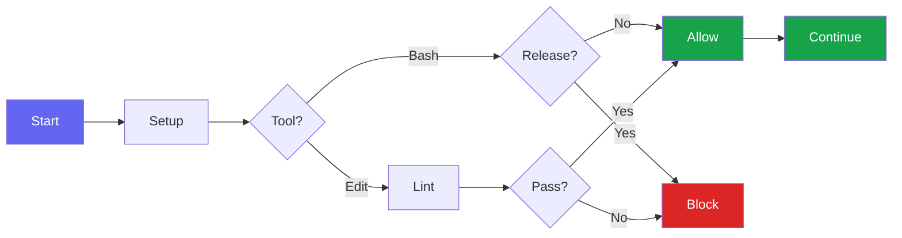

# Hooks

Bluera Base provides automatic validation hooks that run during Claude Code sessions.

## Hook Summary

| Hook | Event | Purpose |
|------|-------|---------|
| `session-setup.sh` | SessionStart | Check jq dependency, fix hook permissions |
| `post-edit-check.sh` | PostToolUse (Write/Edit) | Auto-lint, typecheck, anti-pattern detection |
| `block-manual-release.sh` | PreToolUse (Bash) | Enforces `/bluera-base:release` command for releases |
| `milhouse-stop.sh` | Stop | Intercepts exit to continue milhouse loop iterations |
| `auto-commit.sh` | Stop | Triggers `/bluera-base:commit` on session stop if uncommitted changes exist (opt-in) |
| `notify.sh` | Notification | Cross-platform notifications (macOS/Linux/Windows) |

## Hook Flow



---

## post-edit-check.sh

On every Write/Edit operation, the hook auto-detects your project type and runs appropriate checks.

### JavaScript/TypeScript

- Auto-detects package manager (bun/yarn/pnpm/npm) from lockfiles
- Runs ESLint with `--fix` on modified files
- Type-checks with `tsc --noEmit` if tsconfig.json exists

### Python

- Runs `ruff check --fix` (preferred) or `flake8`
- Type-checks with `mypy` if pyproject.toml/mypy.ini exists

### Rust

- Auto-formats with `cargo fmt`
- Runs `cargo clippy` for linting
- Runs `cargo check` for compile errors

### Go

- Runs `golangci-lint` (preferred) or `go vet`

### All Languages

- Anti-pattern detection: blocks `fallback`, `deprecated`, `backward compatibility`, `legacy`
- Strict typing (opt-in via `/bluera-base:config enable strict-typing`):
  - TypeScript: blocks `any`, unsafe `as` casts, `@ts-ignore`, `@ts-nocheck`
  - Python: blocks `Any`, `type: ignore` without code, `cast()`

Exit code 2 blocks the operation and shows the error to Claude.

---

## block-manual-release.sh

Prevents bypassing the release workflow by blocking direct version/release commands like:

- `npm version`
- `poetry version`
- `cargo release`

Use `/bluera-base:release` instead for standardized releases.

---

## milhouse-stop.sh

Intercepts the Stop event to continue iterative development loops. When a milhouse loop is active, this hook feeds the prompt back to continue work until completion criteria are met.

---

## auto-commit.sh

**Opt-in feature.** Enable with:

```bash
/bluera-base:config enable auto-commit
```

When enabled, triggers `/bluera-base:commit` on session stop if there are uncommitted changes.

---

## notify.sh

Sends cross-platform notifications for long-running operations:

- **macOS**: Uses `osascript` for native notifications
- **Linux**: Uses `notify-send`
- **Windows**: Uses PowerShell toast notifications

---

## See Also

- [Hook Examples](hook-examples.md) - Additional hook patterns
- [Customization](customization.md) - Creating custom hooks
