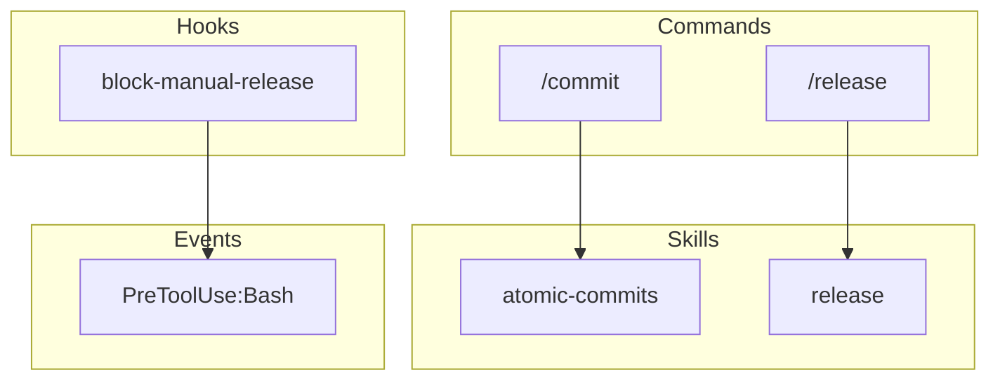

# Claude Code Graph

Generate a structural analysis and dependency graph of a Claude Code plugin. Outputs component inventory, dependency mappings, and Mermaid visualization.

## Context

!`ls .claude-plugin/plugin.json 2>/dev/null && echo "Plugin detected" || echo "No plugin.json - specify path"`

## Workflow

### Phase 1: Discover Components

**Plugin Manifest:**

```bash
PLUGIN_PATH="${1:-.}"
cat "$PLUGIN_PATH/.claude-plugin/plugin.json" | jq '{name, version, description}'
```

**Commands:**

```bash
ls "$PLUGIN_PATH/commands/"*.md 2>/dev/null | wc -l
```

**Skills:**

```bash
ls -d "$PLUGIN_PATH/skills/"*/ 2>/dev/null | wc -l
```

**Hooks:**

```bash
cat "$PLUGIN_PATH/hooks/hooks.json" 2>/dev/null | jq '.hooks | keys'
```

**Agents:**

```bash
ls "$PLUGIN_PATH/agents/"*.md 2>/dev/null | wc -l
```

### Phase 2: Parse Metadata

For each component, extract:

1. **Commands**: Read frontmatter for `allowed-tools`, `argument-hint`, skill reference
2. **Skills**: Read SKILL.md frontmatter for `name`, `description`, `allowed-tools`
3. **Hooks**: Parse hooks.json for event bindings and scripts
4. **Agents**: Read agent definitions if present

**Frontmatter Extraction:**

For markdown files, extract YAML frontmatter between `---` markers:

```bash
sed -n '/^---$/,/^---$/p' FILE.md | sed '1d;$d' | yq -o json
```

### Phase 3: Build Dependency Graph

**Command → Skill:**

Look for `See skills/*/SKILL.md` patterns in command files.

**Skill → Tools:**

Extract `allowed-tools` from frontmatter.

**Skill → Skill:**

Look for `Task` tool usage with skill references, or `@skill-name` patterns.

**Hook → Event:**

Parse hooks.json structure:

```json
{
  "hooks": {
    "EVENT_TYPE": [
      { "matcher": "...", "hooks": ["script.sh"] }
    ]
  }
}
```

### Phase 4: Generate Output

#### JSON Structure

```json
{
  "plugin": {
    "name": "plugin-name",
    "version": "1.0.0",
    "path": "/path/to/plugin"
  },
  "components": {
    "commands": [
      { "name": "commit", "file": "commands/commit.md", "description": "...", "allowedTools": [...] }
    ],
    "skills": [
      { "name": "atomic-commits", "file": "skills/atomic-commits/SKILL.md", "description": "...", "allowedTools": [...] }
    ],
    "hooks": [
      { "event": "PreToolUse", "matcher": "Bash", "script": "block-manual-release.sh" }
    ],
    "agents": []
  },
  "dependencies": {
    "commandToSkill": {
      "commit": "atomic-commits"
    },
    "skillToTools": {
      "atomic-commits": ["Read", "Write", "Bash", "Glob"]
    },
    "skillToSkill": {
      "release": ["claude-code-guide"]
    },
    "hookToEvent": {
      "block-manual-release.sh": "PreToolUse:Bash"
    }
  },
  "stats": {
    "totalCommands": 27,
    "totalSkills": 20,
    "totalHooks": 13,
    "totalAgents": 1
  }
}
```

#### Mermaid Diagram

Generate a Mermaid flowchart showing relationships:



## Arguments

| Argument | Description |
|----------|-------------|
| `[path]` | Path to plugin directory (default: current directory) |
| `--json` | Output raw JSON only |
| `--mermaid` | Output Mermaid diagram only |
| `--output FILE` | Write output to file |

## Output Format

Default output shows:

1. **Summary table** of components
2. **Dependency map** showing key relationships
3. **Mermaid diagram** (collapsed by default)

### Example Output

```text
## Plugin Analysis: bluera-base v0.28.0

### Components

| Type | Count |
|------|-------|
| Commands | 27 |
| Skills | 20 |
| Hooks | 13 |
| Agents | 1 |

### Key Dependencies

**Commands → Skills:**
- /commit → atomic-commits
- /release → release
- /claude-code-md → claude-code-md-maintainer

**Hooks → Events:**
- block-manual-release.sh → PreToolUse:Bash
- milhouse-stop.sh → Stop

<details>
<summary>Mermaid Diagram</summary>

(diagram here)

</details>
```

## Constraints

- Read-only analysis (no modifications)
- Fail fast if plugin.json missing (required file)
- Support both current directory and explicit path
- Generate valid Mermaid syntax
